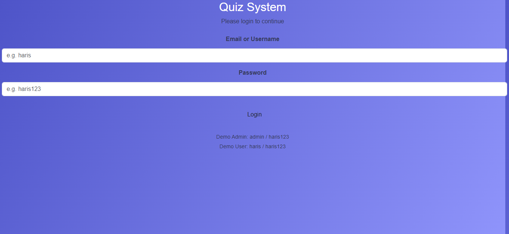
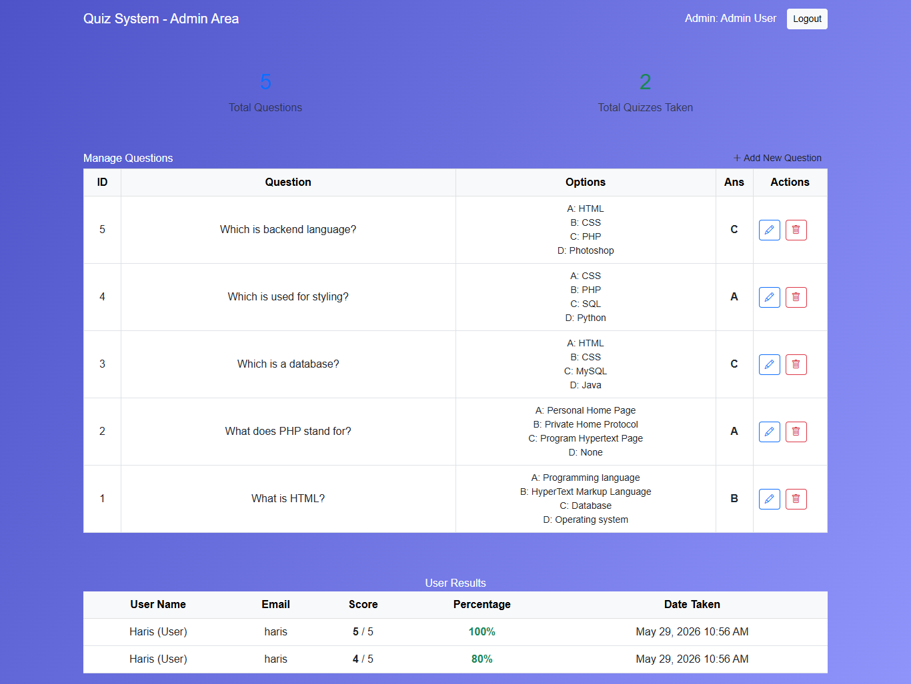
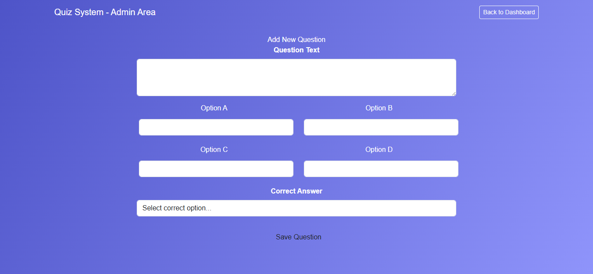
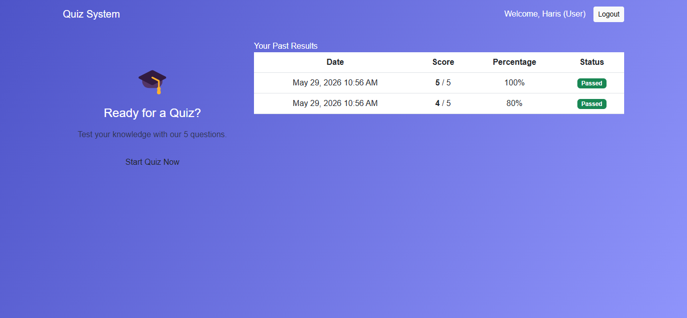
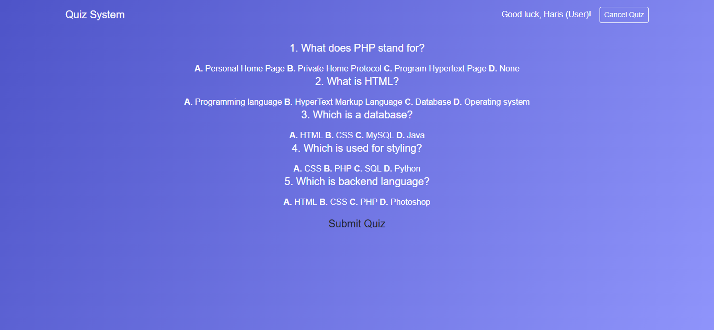

# 🧠 Online Quiz System

A fully functional Online Quiz System developed using PHP, MySQL, JavaScript, AJAX, HTML, CSS, and Bootstrap. This system allows admins to create and manage quiz questions, while users can attempt quizzes and receive instant results with automatic scoring.

---

## 🚀 Features

### 👨‍💼 Admin Panel
- Secure admin login system
- Add quiz questions
- Edit quiz questions
- Delete quiz questions
- Manage quiz content

### 🎓 User Panel
- User login system
- Attempt quizzes
- Submit answers
- View quiz results
- Track performance

---

## 🛠️ Technologies Used

- PHP (Backend)
- MySQL (Database)
- JavaScript
- AJAX
- HTML5
- CSS3
- Bootstrap

---

## 📂 Project Structure

/admin → Admin panel (add/edit/delete questions)
/user → User panel (quiz attempt & submission)
/includes → Database connection
/assets → CSS files
/database → SQL database file
/screenshots → Project screenshots
index.php → Main entry page
login.php → Login page
logout.php → Logout system

---

## 📸 Screenshots

### 🔐 Login Page

### 👨‍💼 Admin Dashboard

### ➕ Add Question (Admin)

### 🎓 User Dashboard

### 🧠 Attempt Quiz

---

## ⚙️ Installation Guide

1. Clone or download this repository

git clone https://github.com/hariskhan-136/online-quiz-system.git

Import database file
/database/quiz_system.sql

Configure database connection
/includes/db.php

🌐 Live Demo

👉 https://harisvoting.infinityfreeapp.com/quiz-system/

👨‍💻 Developer Info

Student Project (BS Computer Science)
Full Stack Web Development Project
Focus: Online Quiz Management System using PHP & MySQL

📌 Note

This project demonstrates:

Authentication system
CRUD operations
Dynamic quiz system
Database-driven application
Role-based system (Admin & User)

⭐ If you like this project, please give it a star on GitHub!
